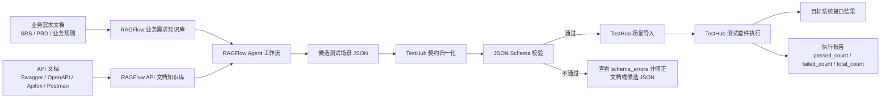

# RAGFlow 到 TestHub 链路接入准备清单

- `ragflow-knowledge-base-builder`：用于创建和验证 RAGFlow 知识库的 skill。
- `ragflow-testhub-agent-workflow`：用于创建 RAGFlow Agent 工作流，并打通到 TestHub 导入和执行的skill。

## 1. 你最终会得到什么

完成接入后，应得到以下结果：

- 一个业务需求知识库。
- 一个 API 文档知识库。
- 一个 RAGFlow Agent 工作流。
- 一份由 RAGFlow 生成的候选测试场景 JSON。
- 一份经过 TestHub 契约归一化和校验的测试场景 JSON。
- TestHub 中自动创建的 API 项目、环境、接口集合和测试套件。
- TestHub 中的测试执行结果。

整体链路如下：

```text
业务需求文档 + API 文档
→ RAGFlow 两个知识库
→ RAGFlow Agent 工作流
→ 候选测试场景 JSON
→ TestHub 契约归一化和校验
→ TestHub 导入
→ TestHub 执行
→ 目标系统接口结果
```

流程图：



## 2. 接入前必须准备的信息

### 2.1 项目基础信息

请准备：

| 信息 | 说明 | 示例 |
| --- | --- | --- |
| 项目名称 | 用于命名知识库、工作流和 TestHub 项目 | 用户管理自动化测试 |
| 业务域 | 说明本次测试属于哪个业务模块 | 用户管理、订单管理、权限管理 |
| 测试范围 | 说明本次只测哪些功能 | 用户新增、查询、删除 |
| 最小业务闭环 | 推荐 3-5 个接口步骤 | 登录 → 创建用户 → 查询用户 → 删除用户 |
| 期望执行环境 | 开发、测试、预发等 | test / staging |

最小业务闭环建议包含：

- 登录或获取 Token。
- 创建一条可测试的数据。
- 查询或验证这条数据。
- 删除或清理这条数据。

## 3. RAGFlow 需要准备的信息

### 3.1 RAGFlow 连接信息

请准备：

| 信息 | 说明 | 是否敏感 |
| --- | --- | --- |
| RAGFlow API Base URL | RAGFlow API 地址，通常以 `/api/v1` 结尾 | 否 |
| RAGFlow API Key | 用于调用 RAGFlow API | 是 |
| 可用模型 ID | RAGFlow 中已配置好的模型名称 | 否 |

示例格式：

```text
RAGFLOW_API=http://http://10.9.3.113//api/v1
RAGFLOW_KEY=******
LLM_MODEL_ID=gemma-4-31b-it___OpenAI-API@OpenAI-API-Compatible
```

注意：

- 不要把 RAGFlow API Key 写入文档或提交到代码仓库。
- 建议通过环境变量或本地 `.env` 管理密钥。

### 3.2 RAGFlow 模型配置

请确认 RAGFlow 中至少有一个可用于工作流生成的模型。

需要提供：

| 信息 | 说明 |
| --- | --- |
| 模型名称 | RAGFlow UI 中显示的模型 ID |
| 模型用途 | 用于 Agent 工作流生成候选测试场景 |
| 默认模型配置 | 确认 RAGFlow 默认 LLM / VLM 配置已可用 |

如果不确定模型是否可用，请先在 RAGFlow UI 中做一次简单问答测试。

## 4. 文档资料需要准备什么

当前推荐创建两个知识库：

1. 业务需求知识库。
2. API 文档知识库。

### 4.1 业务需求文档

请准备以下任一种资料：

- SRS 文档
- PRD 文档
- 需求说明 PDF
- 业务规则文档
- 验收标准文档
- 测试范围说明文档

建议文档中包含：

| 内容 | 说明 |
| --- | --- |
| 功能说明 | 说明功能目标和主要流程 |
| 字段规则 | 字段是否必填、格式、长度、唯一性等 |
| 业务规则 | 例如状态流转、权限限制、数据约束 |
| 异常场景 | 例如重复、缺失、越权、非法参数 |
| 验收标准 | 说明怎样算测试通过 |

### 4.2 API 文档

请准备以下任一种资料：

- Swagger / OpenAPI URL
- OpenAPI JSON 文件
- Apifox 导出文件
- Postman Collection
- 手工整理的接口文档

API 文档中应包含：

| 内容 | 说明 |
| --- | --- |
| Method | GET / POST / PUT / DELETE 等 |
| Path | 接口路径 |
| Query Params | URL 查询参数 |
| Request Body | 请求体字段和必填规则 |
| Headers | 鉴权、租户、Content-Type 等 |
| Response Structure | 响应字段结构 |
| Auth Rule | 是否需要 Token 或其他认证 |

如果提供 Swagger / OpenAPI URL，请同时说明：

- 是否只处理某些模块或 tags。
- 是否排除无关接口。
- 是否只保留本次测试范围内接口。

## 5. 两个 RAGFlow 知识库需要输出什么

使用 `ragflow-knowledge-base-builder` 创建知识库后，需要记录以下结果。

### 5.1 业务需求知识库

请记录：

```text
SRS_KB_NAME=
SRS_KB_ID=
SRS_DOCUMENT_IDS=
SRS_CHUNK_METHOD=
SRS_CHUNK_COUNT=
SRS_PARSE_STATUS=
```

### 5.2 API 文档知识库

请记录：

```text
API_DOCS_KB_NAME=
API_DOCS_KB_ID=
API_DOCS_DOCUMENT_IDS=
API_DOCS_CHUNK_METHOD=
API_DOCS_CHUNK_COUNT=
API_DOCS_PARSE_STATUS=
```

### 5.3 检索验证结果

请至少验证 3-5 个关键问题能检索到正确内容。

示例：

```text
登录接口路径和响应 token 字段是什么？
创建资源接口需要哪些请求体字段？
查询资源详情如何传 ID？
删除资源接口路径是什么？
目标接口需要哪些 Header？
```

如果检索不到关键接口或字段，应先修正文档或重新切分知识库，再创建工作流。

## 6. TestHub 需要准备的信息

### 6.1 TestHub 服务信息

请准备：

| 信息 | 说明 | 示例 |
| --- | --- | --- |
| TestHub 后端地址 | TestHub API 服务地址 | http://localhost:3000/api |
| 本地用户名 | 用于导入和执行测试套件 | admin |
| 是否自动执行 | 导入后是否立即执行 suite | 是 / 否 |

如果通过 API 登录，还需要：

| 信息 | 说明 | 是否敏感 |
| --- | --- | --- |
| 登录接口 | TestHub 登录接口路径 | 否 |
| TestHub 用户名 | 用于获取访问 Token | 否 |
| TestHub 密码 | 用于获取访问 Token | 是 |

### 6.2 TestHub 场景契约

当前链路使用以下契约文件：

```text
contracts/ragflow-testhub-scenario-schema.json
```

接入前请确认该文件存在，并且当前项目支持 `schema_version=1.0.0`。

## 7. 目标系统需要准备的信息

目标系统是最终被 TestHub 调用和验证的业务系统。

请准备：

| 信息 | 说明 | 是否敏感 |
| --- | --- | --- |
| TARGET_BASE_URL | 目标系统 API Base URL | 否 |
| TARGET_AUTH_USERNAME | 目标系统测试账号 | 视情况 |
| TARGET_AUTH_PASSWORD | 目标系统测试密码 | 是 |
| TARGET_TENANT_ID | 租户 ID，如系统需要 | 视情况 |
| TARGET_EXTRA_HEADERS | 其他必须 Header | 视情况 |

示例：

```text
TARGET_BASE_URL=http://target.example.com
TARGET_AUTH_USERNAME=admin
TARGET_AUTH_PASSWORD=******
TARGET_TENANT_ID=1
TARGET_EXTRA_HEADERS=tenant-id: 1
```

### 7.1 最小业务闭环信息

请用自然语言说明本次希望生成的测试流程。

示例：

```text
生成用户管理最小主流程接口自动化场景：
1. 管理员登录并提取 token。
2. 创建一个测试用户。
3. 查询该测试用户详情。
4. 删除该测试用户。
```

### 7.2 测试数据约束

请提前说明目标系统的数据约束。

常见约束包括：

- 用户名是否只能包含字母和数字。
- 手机号是否必须唯一。
- 邮箱是否必须唯一。
- 是否必须传部门 ID、角色 ID、岗位 ID 等。
- 哪些 ID 在测试环境中是真实存在的。
- 创建的数据是否必须在流程结束时删除。

这些信息会影响生成的测试场景是否能成功执行。

## 8. 创建工作流前的交接信息

当两个知识库都创建并验证完成后，请准备以下交接信息给 `ragflow-testhub-agent-workflow`。

```text
项目名称：
业务域：
测试范围：
最小业务闭环：

RAGFLOW_API=
RAGFLOW_KEY=******
LLM_MODEL_ID=

SRS_KB_ID=
API_DOCS_KB_ID=

TESTHUB_BASE_URL=
TESTHUB_USERNAME=
TESTHUB_PASSWORD=******
TESTHUB_SCENARIO_SCHEMA=contracts/ragflow-testhub-scenario-schema.json

TARGET_BASE_URL=
TARGET_AUTH_USERNAME=
TARGET_AUTH_PASSWORD=******
TARGET_TENANT_ID=
TARGET_EXTRA_HEADERS=

是否自动导入 TestHub：是 / 否
是否导入后立即执行：是 / 否
是否保存归一化 JSON：是 / 否
是否保存执行报告：是 / 否
```

## 9. 执行命令时需要准备的信息

工作流创建完成后，可以通过 TestHub management command 执行链路。

### 9.1 在线调用 RAGFlow Agent

需要准备：

```text
RAGFLOW_KEY
RAGFLOW_API
RAGFLOW_AGENT_ID
TestHub 本地用户名
目标系统环境变量
用户问题 / 业务流程描述
```

命令格式：

```bash
export RAGFLOW_KEY='******'

python manage.py run_ragflow_testhub_scenario \
  --agent-id <RAGFLOW_AGENT_ID> \
  --ragflow-api <RAGFLOW_API> \
  --username <TESTHUB_LOCAL_USERNAME> \
  --question '<BUSINESS_FLOW_QUESTION>' \
  --env-var baseUrl=<TARGET_BASE_URL> \
  --env-var tenantId=<TARGET_TENANT_ID> \
  --env-var adminUsername=<TARGET_AUTH_USERNAME> \
  --env-var adminPassword='******'
```

### 9.2 使用本地候选 JSON

如果已经从 RAGFlow 导出了候选 JSON，需要准备：

```text
candidate JSON 文件路径
TestHub 本地用户名
目标系统环境变量
```

命令格式：

```bash
python manage.py run_ragflow_testhub_scenario \
  --candidate-json /path/to/candidate.json \
  --username <TESTHUB_LOCAL_USERNAME> \
  --env-var baseUrl=<TARGET_BASE_URL> \
  --env-var tenantId=<TARGET_TENANT_ID> \
  --env-var adminUsername=<TARGET_AUTH_USERNAME> \
  --env-var adminPassword='******'
```

### 9.3 可选输出

如果需要保存中间结果，请准备输出路径：

```bash
--normalized-output /tmp/normalized-scenario.json
--report-output /tmp/ragflow-testhub-report.json
```

## 10. 验收标准

一次接入成功应满足：

- 两个知识库解析完成。
- 关键接口和业务规则可以被检索到。
- RAGFlow Agent 工作流可以生成候选 JSON。
- TestHub 归一化后 `schema_errors=0`。
- TestHub 导入成功，返回 `project_id`、`environment_id`、`collection_ids`、`suite_ids`。
- 如果启用自动执行，执行结果应返回 `execution_id`、`passed_count`、`failed_count`、`total_count`。
- 临时测试数据在流程结束后被清理。

## 11. 敏感信息处理要求

请遵守以下规则：

- 不要把 RAGFlow API Key 写入文档。
- 不要把目标系统密码写入知识库文档。
- 不要提交包含真实密码的候选 JSON、归一化 JSON 或报告文件。
- 推荐使用环境变量传入密钥。
- 对外沟通时使用 `******` 标记敏感字段。
- 如果需要留存执行样例，应使用脱敏数据。

## 12. 提交给执行人员的最终清单模板

可以直接复制以下模板填写：

```text
# 项目信息
项目名称：
业务域：
测试范围：
最小业务闭环：

# RAGFlow
RAGFLOW_API=
RAGFLOW_KEY=******
LLM_MODEL_ID=
RAGFLOW_AGENT_ID=（创建工作流后填写）

# 知识库
SRS/PRD 文档路径或 URL：
API 文档路径或 URL：
SRS_KB_ID=（创建知识库后填写）
API_DOCS_KB_ID=（创建知识库后填写）

# TestHub
TESTHUB_BASE_URL=
TESTHUB_LOCAL_USERNAME=
TESTHUB_SCENARIO_SCHEMA=contracts/ragflow-testhub-scenario-schema.json
是否自动执行：是 / 否

# 目标系统
TARGET_BASE_URL=
TARGET_AUTH_USERNAME=
TARGET_AUTH_PASSWORD=******
TARGET_TENANT_ID=
TARGET_EXTRA_HEADERS=

# 测试数据约束
唯一字段规则：
必填字段规则：
可用部门/角色/岗位 ID：
是否需要清理测试数据：是 / 否

# 输出要求
是否保存归一化 JSON：是 / 否
是否保存执行报告：是 / 否
输出目录：
```
